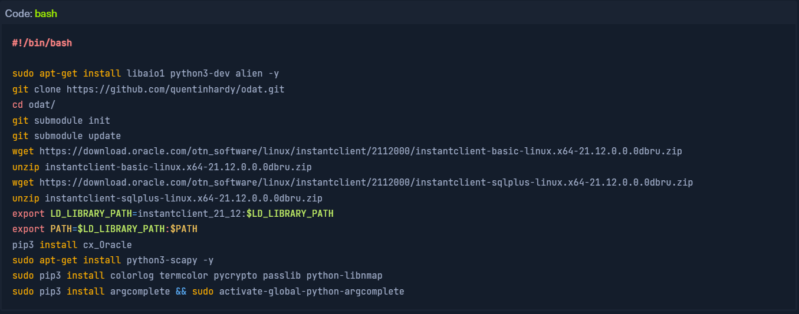

# Microsoft Structured Query Language

## MSSQL Databases

| Default System Database | Description                                                                                                                                                                                            |
| ----------------------- | ------------------------------------------------------------------------------------------------------------------------------------------------------------------------------------------------------ |
| `master`                | Tracks all system information for an SQL server instance                                                                                                                                               |
| `model`                 | Template database that acts as a structure for every new database created. Any setting changed in the model database will be reflected in any new database created after changes to the model database |
| `msdb`                  | The SQL Server Agent uses this database to schedule jobs & alerts                                                                                                                                      |
| `tempdb`                | Stores temporary objects                                                                                                                                                                               |
| `resource`              | Read-only database containing system objects included with SQL server                                                                                                                                  |

## Footprinting The Service

### Nmap MSSQL Script Scan


```
sudo nmap --script ms-sql-info,ms-sql-empty-password,ms-sql-xp-cmdshell,ms-sql-config,ms-sql-ntlm-info,ms-sql-tables,ms-sql-hasdbaccess,ms-sql-dac,ms-sql-dump-hashes --script-args mssql.instance-port=1433,mssql.username=sa,mssql.password=,mssql.instance-name=MSSQLSERVER -sV -p 1433 10.129.201.248
```


<figure><figcaption></figcaption></figure>

### **Connecting with Mssqlclient.py**


```
python3 mssqlclient.py Administrator@10.129.201.248 -windows-auth
```


<figure><figcaption></figcaption></figure>

## MSSQL Commands

| Query                            | Description                               |
| -------------------------------- | ----------------------------------------- |
| `SELECT name FROM sys.databases` | Lists all databases on the SQL Server.    |
| `SELECT * FROM sys.tables`       | Lists all tables in the current database. |
